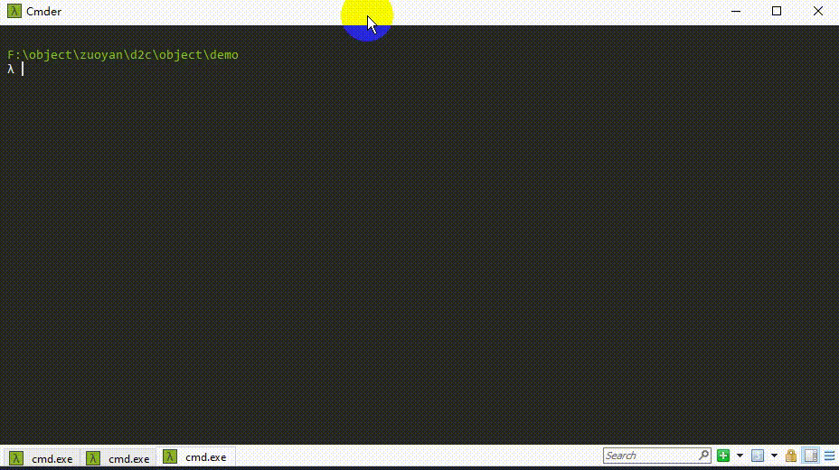
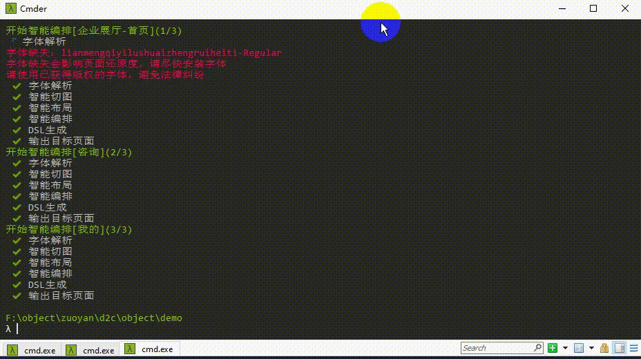

### 左盐lens
**zuoyan lens**是一个通过智能算法将设计稿转换为前端页面的产品（design to code），是`低代码`平台的一个分支方向， 他的输入是设计稿产出是前端页面，中间无需值守即可自动完成。

此项目可以一键将 Sketch、Photoshop 的设计稿转换为可维护的前端代码。`100 个 page 的工作量 10 分钟内即可轻松搞定`，极大释放前端生产力。


### 特点
##### 生产级代码
  * 通过智能算法推算出和手写代码一样的结构和css逻辑，产出的代码约等于一个中级前端的水平
  * 全flex布局
  * 根据元素所处的环境， 自动修正像素误差，符合设计表达。
  * 代码可阅读、可维护.

##### 智能切图
  * 自动生成透明png切图， 不需要设计或开发手动切图导图
  * 自动生成`icon` `svg`文件， 可直接上传到`iconfont`等作为字体图标使用，亦可转为 svg 雪碧
##### 自动检测字体
  * 自动检测设计稿字体，如果字体缺失会自动提示安装， 如果字体不一致会影响到页面还原度，不方便安装的字体，可以让设计师合并图层
##### 循环布局识别
 * 自动识别`list`，`grid`等布局方式
  * 独有结点空间结构匹配算法， 能精确推算循环体，而且性能表现优异
##### 跨平台，系统无关
  * 兼容所有平台，windows和linux上也可以解析`Sketch`文件
  
##### 设计师学习成本为0
  *  只需要准守正常的设计规范即可， 其他无任何要求
##### 开放AST转换，可以自由定义输出
* 采用`GoGoCode`来做AST转换, 可以自由定义输出语言，语法， 比如转为：React， 微信原生，Vue，uniapp，Taro，RN等

##### 还原度高
 * 项目实测设计稿的还原度中位数为0.95，完全可以达到生产交付标准，极大降低 UI 走查成本

### 使用场景
* 移动端细粒度模块开发场景 - 特别推荐
* 移动端活动页 - 推荐
* 移动端全页面开发 - 特别推荐
* PC 端 toC 应用 - 暂无适配
* PC 端 toB 应用 - 暂无适配
* PC 端富交互应用 - 暂无适配
* 游戏场景 - 暂无适配
  
### 如何使用
#### 直接使用
1, 安装
```js
npm i -g @zuoyanart/lens
```
2，切换到项目目录执行命令（目录参考demo）
```js
lens g [platform]//platform: h5 or uniapp
````

#### 二开使用
1，克隆项目代码
```
git clone 本项目地址
```
2， 建立连接
```
npm link
```
3, 切换到项目目录执行命令（目录参考demo）
```js
lens g [platform]//platform: h5 or uniapp
````

**目前只提供了h5和uniapp两种DSL转换， 其他的可以自行编写代码**


[示例demo](./demo)。

### 设计稿格式与输出平台
| 设计稿格式 | 解析方式 | 支持程度                | 说明 |
| ---------- | -------- | ----------------------- | ---- |
| Sketch     | 系统直译 | :ballot_box_with_check: |      |
| PS         | 系统直译 | 筹备中                  |      |

### 备注
#### 解决sharp安装慢问题
```js
npm config set sharp_binary_host "https://npm.taobao.org/mirrors/sharp"
npm config set sharp_libvips_binary_host "https://npm.taobao.org/mirrors/sharp-libvips"
```

### 演示
#### 生成静态页


#### 验证还原度


### 大版本 RoadMap

- [x] 文本分类。 使css更加语义化
- [ ] 自动组合图形算法增强
- [ ] 图片分类。 自动识别icon图标
- [ ] 目标检测。 自动识别组件
### changeLog
[changeLog](./changeLog.md)


### 配置文件说明
```js
module.exports = {
  source: {
    path: './source/useCase.sketch',
    artboardName:'产品详情1',
    baseWidth:375 //设计稿基准宽度px
  },
  h5:{
    page:{
      extName:'.html'
    },
    style:{
      extName:'.css',
      pageDisplayPath: './',
      unit:{
        scale: 0.02, //缩放比例
        precision: 6, //小数精度
        name: 'rem'
      }
    },
    image:{
      pageDisplayPath: './images'
    }
  },
  uniapp:{
    style:{
      extName:'.css',
      pageDisplayPath: './',
      unit:{
        scale: 2, //缩放比例
        precision: 6, //小数精度
        name: 'rpx'
      }
    },
    image:{
      pageDisplayPath: './images'
    },
    page:{
      extName:'.vue'
    }
  }
};

```

#### 联系作者
> 有问题请先issues


